# Shots

## 项目简介

由于目前项目正在开发中，可能会出现很多BUG，大家可以提到Issues等待修复

`Shots`是一款在线资产管理工具，它基于`PHP（数据展示、下发任务）、Python（数据收集）、MySQL（存储数据）`

数据展示：`厂商管理、域名管理、子域名管理、端口管理、存活WEB管理、日志管理、服务器状态监控`

数据收集：`SubDomain（基于OneForAll进行子域名在线收集）、AliveScan（基于子域名对常见WEB端口进行HTTP快速扫描）、PortScan（基于Fofa+Shodan+Nmap）`


### 特点

1. 使用`FastAdmin`框架开发，安装简单、功能完善、更好看的UI
2. 使用API进行`任务下发`与`数据上传`这样做的好处就是可以进行分布式扫描，可以同时利用多台服务器进行`子域名扫描、端口扫描、存活扫描`并可以根据自己的需求控制扫描模块的分布
3. `数据展示`和`数据收集`分割，即使`Python`崩溃了也能够正常的进行`数据展示`，后台具有`日志管理`和`服务器状态监控`能够快速定位出问题的扫描模块及服务器

### 项目展示

> 厂商管理

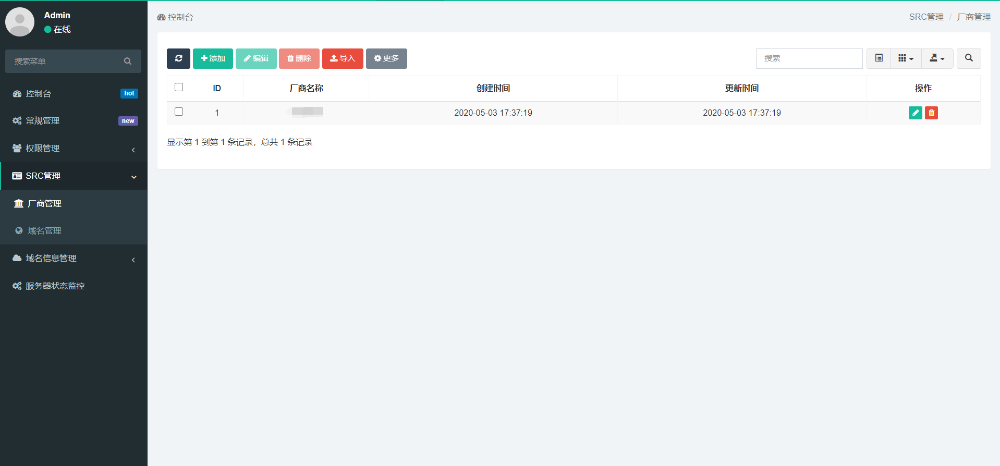


> 域名管理

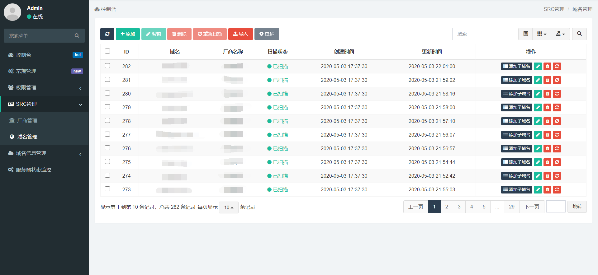

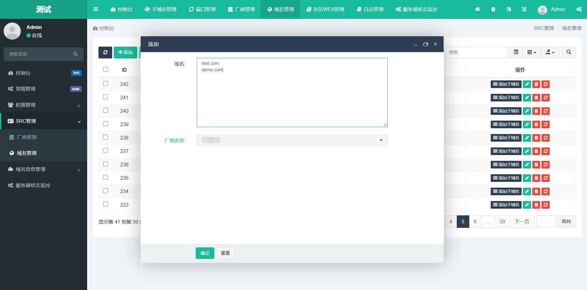


> 子域名管理

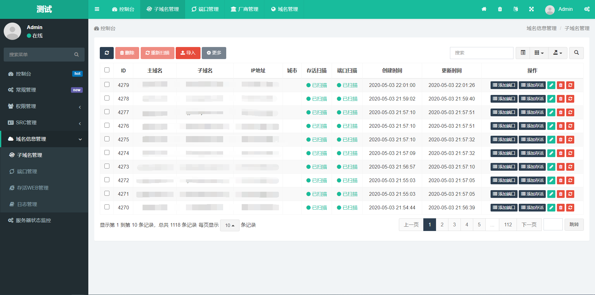


> 端口管理

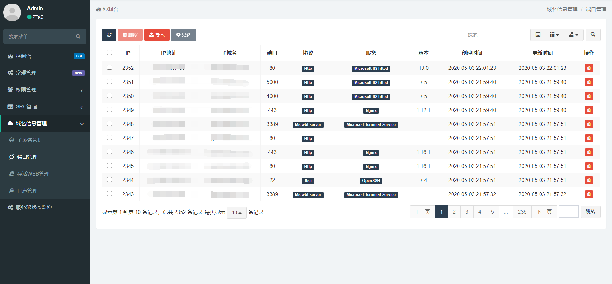


> 存活WEB管理

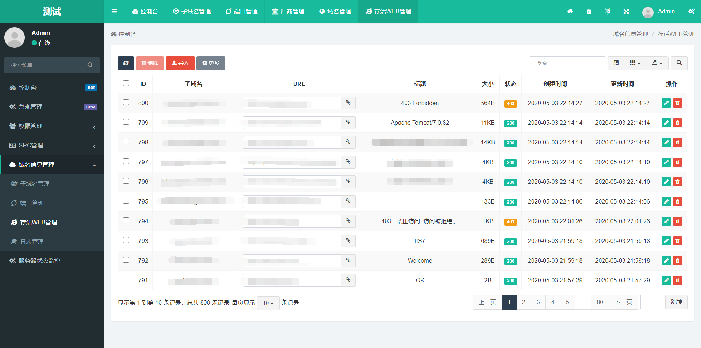


> 日志管理

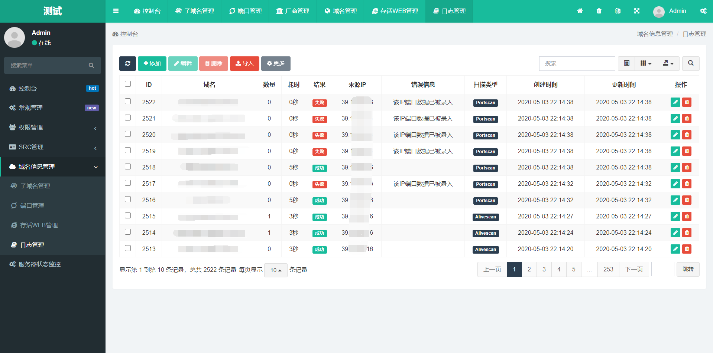


> 服务器状态监控

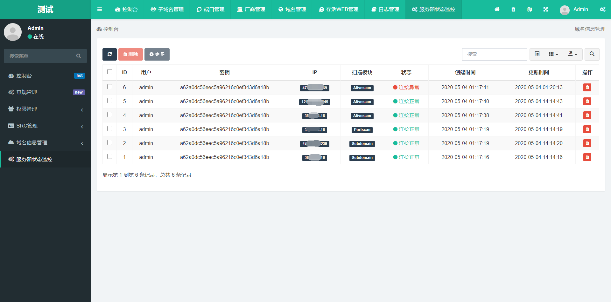


## 安装指南

以Ubuntu18为例


#### 安装服务

```
apt install php-fpm php-gd php-json php-mysql nginx mysql-client mysql-common mysql-server -y
```

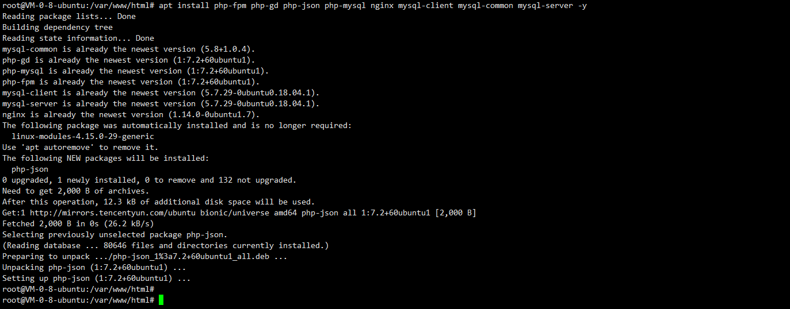


#### 配置PHP+Nginx

```bash
# 启动php-fpm
/etc/init.d/php7.2-fpm start

# 配置nginx
vi /etc/nginx/sites-enabled/default

# 重启nginx
/etc/init.d/nginx restart
```

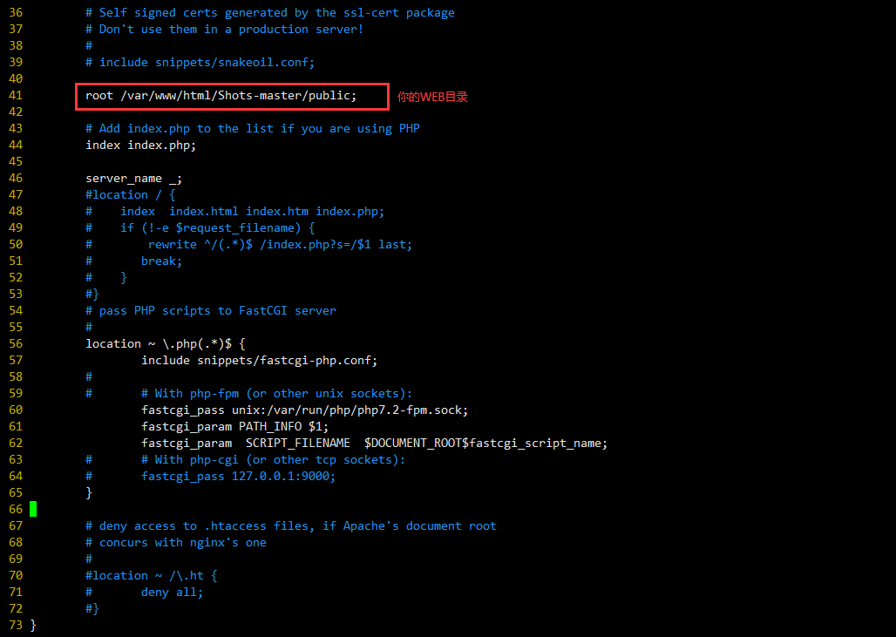


#### 配置MySQL

```mysql
# 创建用户
CREATE USER 'shots'@'localhost' IDENTIFIED BY '123456';  
# 创建数据库
create database shots;
# 授权
GRANT ALL ON shots.* TO 'shots'@'localhost';
# 刷新
flush privileges;
```


#### 安装Shots

```bash
# 增加权限
chmod -R 777 /var/www/html/Shots-master/
```


输入刚才MySQL的账号密码与数据库名

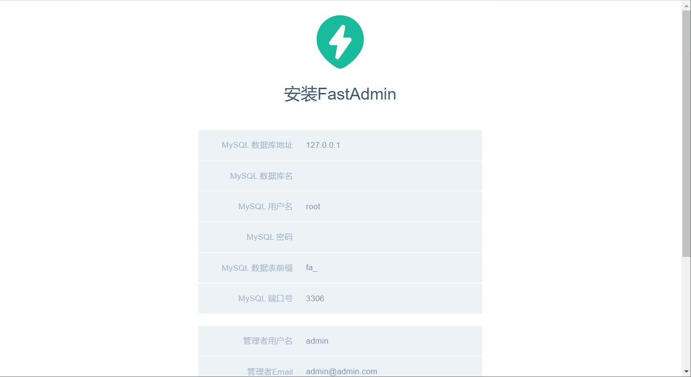

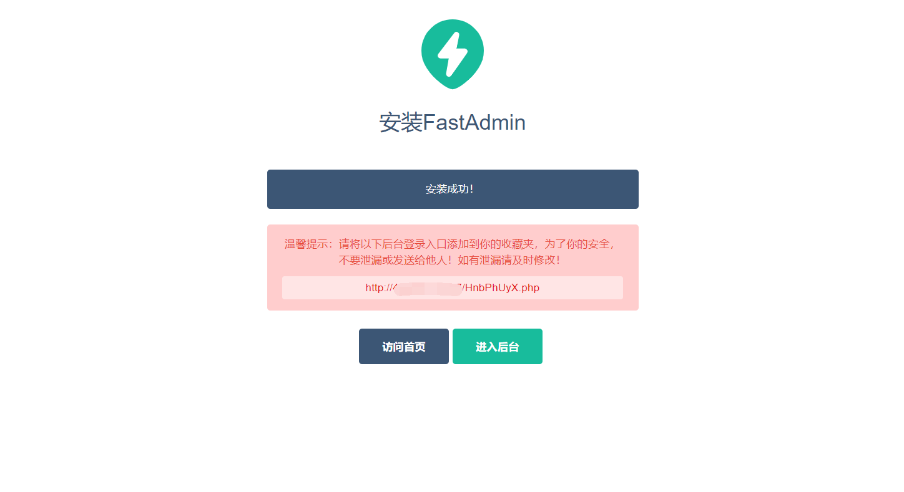

#### 安装ShotsScan

Github：https://github.com/broken5/ShotsScan

环境：`Python 3.6.9、pip 20.1`


1. **安装ShotsScan**

```bash
# 下载ShotsScan
git clone https://github.com/broken5/ShotsScan
# 安装依赖
python3 -m pip install -r requirements.txt -i https://mirrors.aliyun.com/pypi/simple
```


2. **获取Shots密钥**

先创建一个用户


然后生成密钥

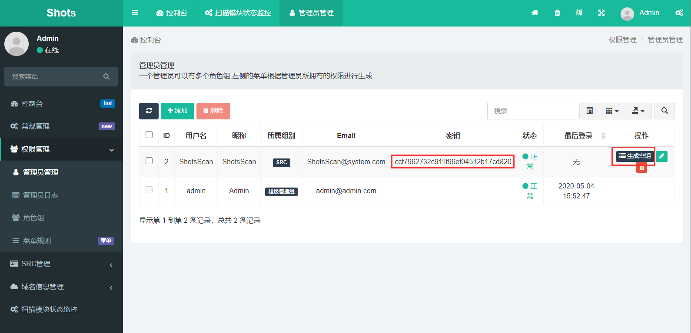


3. **配置config**

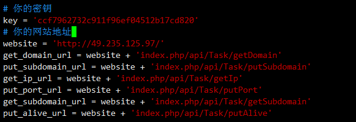


4. **启动扫描脚本**

```
mkdir logs
nohup python3 subdomain.py > logs/subdomain.log &
nohup python3 portscan.py > logs/portscan.log &
nohup python3 alivescan.py > logs/alivescan.log &
```

 

5. **查看模块状态**

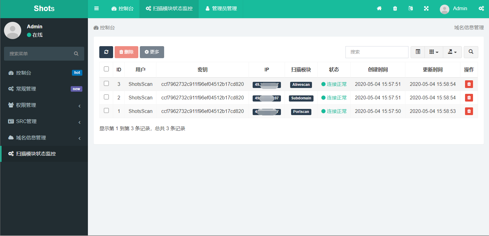


## 感谢以下这些优秀的项目

https://www.fastadmin.net/

https://github.com/shmilylty/OneForAll/

https://github.com/broken5/WebAliveScan

https://github.com/CTF-MissFeng/bayonet
